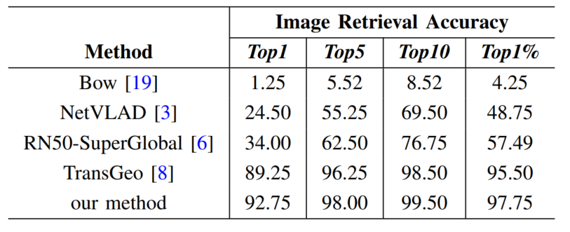

# SSVG
推理测试:python3 singelTest.py
# 注
&#8195;&#8195;在后续对文章的检查中发现**表1第一列**由于数据集路径选择错误与代码存在误差(TOP1%的计算值写成常数4)导致计算填写存在错误。**经过评估，不影响本论文结论**，故在此进行声明。如相关人员关于此误差有仅进一步疑问，请提issue。

&#8195;&#8195;原表如下：

&#8195;&#8195;经过仔细检查和核对后，正确结果应该为下表：

