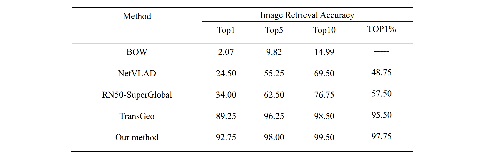

## SSVG
推理测试:python3 singelTest.py
## 声明
&#8195;&#8195;在后续的代码文件整合中发现**表1第一列**存在计算错误的问题。**经过评估，不影响本论文结论**，故在此进行纠正，如相关人员关于此误差有进一步疑问，请提issue。

&#8195;&#8195;正确结果应该为下表：

注：BOW方法中部分作为query的图片无法生成sift特征，仅387张图片参与统计

